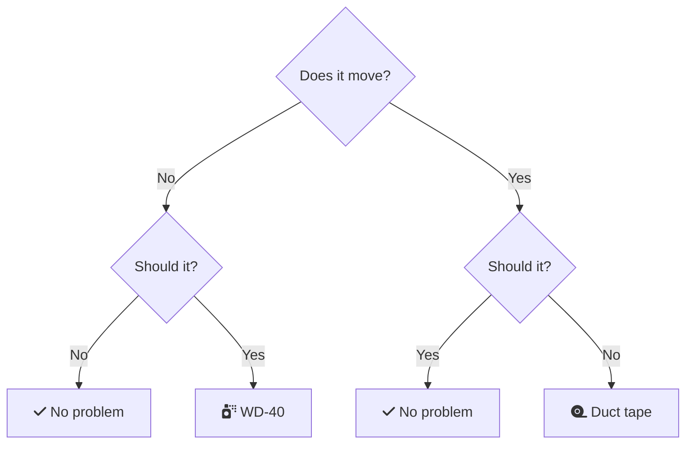

# Webtech

*Bruh*

``` c++
int main(){
    cout << "Kys" <<endll;
}
```
```python
print("rawr")
```

***
 



```mermaid
flowchart TD
    A{Does it move?}
    A -->|No| B{Should it?}
    A -->|Yes| C{Should it?}
    B -->|No| D[fa:fa-check No problem]
    B -->|Yes| E[fa:fa-spray-can WD-40]
    C -->|Yes| F[fa:fa-check No problem]
    C -->|No| G[fa:fa-tape Duct tape]
```